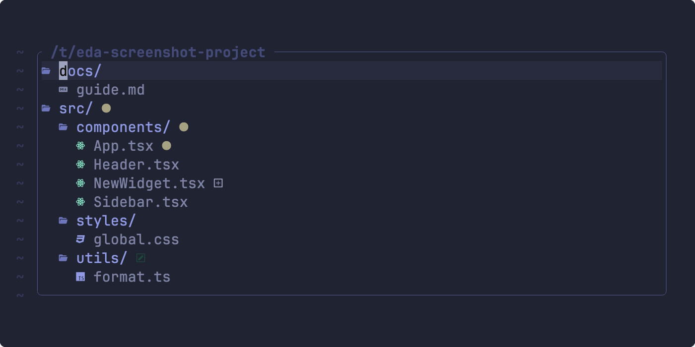
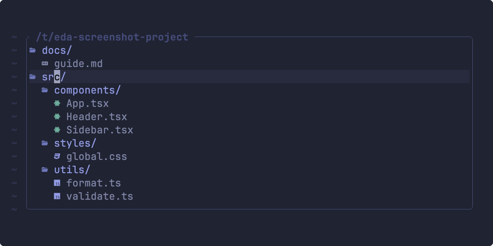
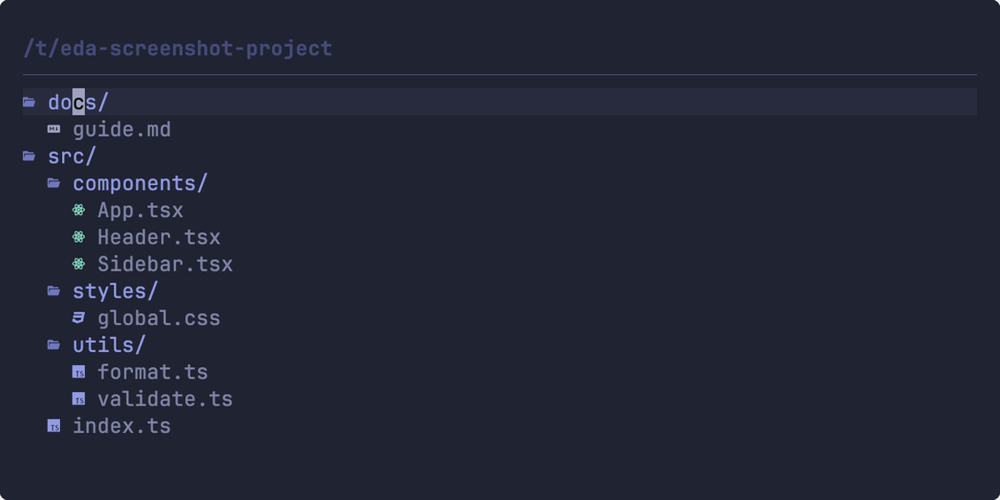
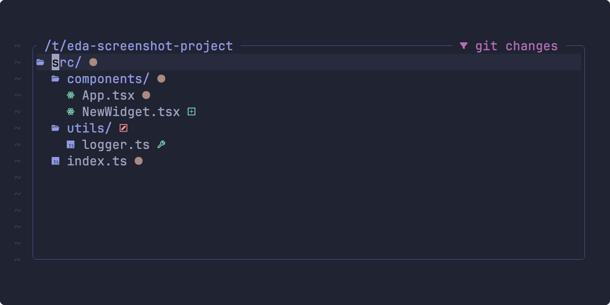
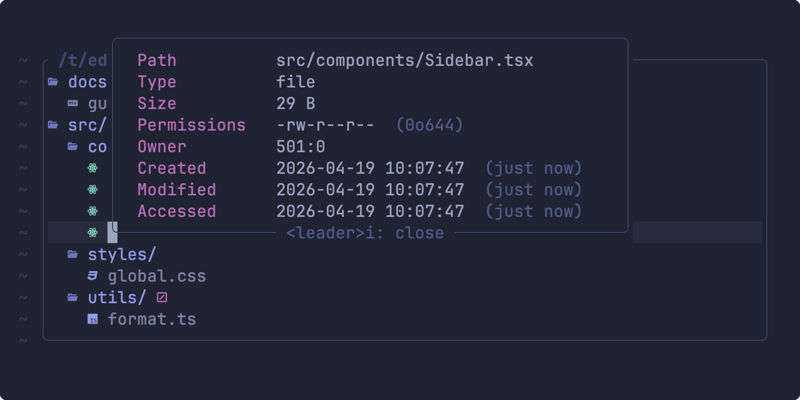
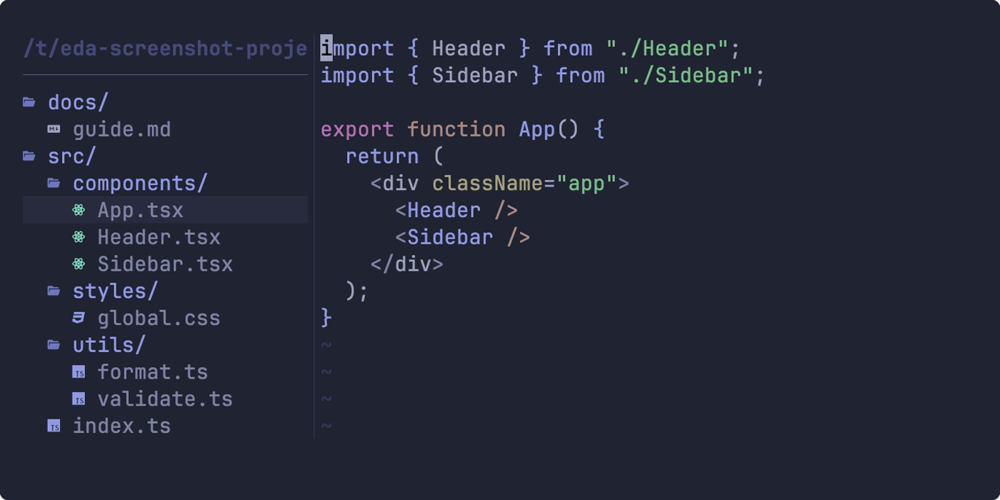

# 🌿 eda.nvim

Explore as a tree, edit as a buffer — a file explorer for Neovim that combines hierarchical navigation with buffer-native file operations.

[](https://github.com/wadackel/eda.nvim/actions/workflows/ci.yaml)

[](LICENSE)

## Demo

### Tree View



### Buffer Editing



### Split Operation



### Filter & Inspect

| Git Changes Filter | Inspect Float |
|--------------------|---------------|
|  |  |

### Layouts

| Split | Replace |
|-------|---------|
|  |  |

## Why eda.nvim?

- ✏️ **Buffer-native editing meets tree view** — Edit the buffer to rename, delete, create, and move files, then `:w` to apply. Combines oil.nvim's buffer-editing paradigm with a full collapsible tree view
- ⚡ **Progressive async rendering** — The target file's ancestor chain is scanned first, so the cursor lands instantly even in large repositories. Remaining directories load in the background
- 🧩 **Extensible action system** — Every operation lives in a named registry. Custom actions receive the same `ActionContext` as built-in ones, making them first-class citizens
- 🎨 **Rich customization** — 60+ highlight groups across 6 categories, function-based config options (`header.format`, `ignore_patterns`, `preview.max_file_size`), and event hooks for plugin integration

> For architecture and design decisions, see [ARCHITECTURE.md](docs/ARCHITECTURE.md).

## Features

- **Buffer-native editing** — Rename, delete, and create files by editing the buffer, then `:w` to apply
- **Tree view with hierarchy** — Collapsible directory tree, not flat per-directory listing
- **Progressive async rendering** — Ancestor chain scanned first for instant cursor placement
- **Git integration** — Async status detection with visual indicators
- **Multiple layouts** — `float`, `split_left`, `split_right`, `replace`
- **Extensible action system** — Named registry with custom actions as first-class citizens
- **netrw replacement** — `hijack_netrw` option for seamless default browsing
- **60+ highlight groups** — Full appearance customization across 6 categories
- **Event hooks** — `EdaTreeOpen`, `EdaTreeClose`, `EdaMutationPre`, `EdaMutationPost`, `EdaRootChanged` for plugin integration. See [`doc/eda.nvim.txt`](doc/eda.nvim.txt) for event payload details.

## Requirements

- Neovim >= 0.11
- [git](https://git-scm.com/) (optional, for git status integration)
- [mini.icons](https://github.com/echasnovski/mini.icons) or [nvim-web-devicons](https://github.com/nvim-tree/nvim-web-devicons) (optional, for file icons)

## Installation

<details>
<summary>lazy.nvim</summary>

```lua
{
  "wadackel/eda.nvim",
  opts = {},
}
```

</details>

<details>
<summary>mini.deps</summary>

```lua
local add = MiniDeps.add
add("wadackel/eda.nvim")
require("eda").setup()
```

</details>

<details>
<summary>packer.nvim</summary>

```lua
use({
  "wadackel/eda.nvim",
  config = function()
    require("eda").setup()
  end,
})
```

</details>

## Quick Start

```lua
require("eda").setup()
```

Open the explorer with the `:Eda` command:

```vim
:Eda                    " Open in current directory (float)
:Eda kind=split_left    " Open as left sidebar
:Eda ~/projects         " Open specific directory
```

> [!TIP]
> Set `hijack_netrw = true` to use eda as the default directory browser. See the [Replace netrw](#recipes) recipe for details.

See [Configuration](#configuration) below for all options, or `:help eda.nvim` for the full reference.

## Configuration

Below are all available options with their default values. You only need to specify the options you want to change — everything is deep-merged with the defaults.

```lua
require("eda").setup({
  -- Markers used to detect the project root
  root_markers = { ".git", ".hg" },
  -- Show hidden/dotfiles by default
  show_hidden = true,
  -- Show git-ignored files by default
  show_gitignored = true,
  -- Show only files with git changes (toggle via `gs`, default off)
  show_only_git_changes = false,
  -- Lua patterns matched against file/directory name (not glob)
  -- Accepts a function: fun(root_path): string[]
  ignore_patterns = {},

  window = {
    -- Layout: "float", "split_left", "split_right", "replace"
    kind = "float",
    -- Border style (see :help nvim_open_win)
    border = "rounded",
    -- Per-kind window dimensions (string percentage or number or function)
    kinds = {
      float = { width = "94%", height = "80%" },
      replace = {},
      split_left = { width = "30%" },
      split_right = { width = "30%" },
    },
    -- Buffer-local options applied to the eda buffer
    buf_opts = {
      filetype = "eda",
      buftype = "acwrite",
    },
    -- Window-local options applied to the eda window
    win_opts = {
      number = false,
      relativenumber = false,
      wrap = false,
      signcolumn = "no",
      cursorline = true,
      foldcolumn = "0",
    },
  },

  -- Use eda as the default directory browser (replaces netrw)
  hijack_netrw = false,
  -- Close explorer window after selecting a file
  close_on_select = false,

  -- Confirmation dialogs (boolean or table; true = all defaults below)
  confirm = {
    -- Confirm before deleting files
    delete = true,
    -- Confirm moves: true, false, or "overwrite_only"
    move = "overwrite_only",
    -- Confirm creation: true, false, or integer (threshold count)
    create = false,
    -- Path display in confirm dialogs: "full", "short", "minimal", or fun(path, root_path): string
    path_format = "short",
    -- Signs shown in confirm dialogs
    signs = {
      create = "", -- nf-oct-plus
      delete = "", -- nf-oct-circle_slash
      move = "",   -- nf-oct-arrow_right
    },
  },

  -- Use trash instead of permanent delete
  delete_to_trash = true,
  -- Follow symbolic links when scanning
  follow_symlinks = true,
  -- Directories with more entries than this skip sorting for performance
  large_dir_threshold = 5000,
  -- Maximum depth for initial directory expansion
  expand_depth = 5,

  -- Automatically reveal the focused file in the tree
  update_focused_file = {
    -- Enable auto-reveal
    enable = false,
    -- Also change the tree root to the file's project root
    update_root = false,
  },

  icon = {
    -- Separator between icon and file name
    separator = " ",
    -- Icon provider: "mini_icons", "nvim_web_devicons", or "none"
    provider = "mini_icons",
    -- Directory glyphs keyed by open/empty state
    directory = {
      collapsed = "󰉋",
      expanded = "󰝰",
      empty = "󰉖",
      empty_open = "󰷏",
    },
    -- Optional hook to override icons per node. Returning nil falls through
    -- to the built-in directory glyphs and the provider lookup.
    -- See `doc/eda.md` for full reference.
    --
    -- custom = function(name, node)
    --   if name == "justfile" then return "󱃔", "EdaFileIcon" end
    --   return nil
    -- end,
    custom = nil,
  },

  git = {
    -- Enable git status integration
    enabled = true,
    -- Git status icons
    icons = {
      untracked = "", -- nf-oct-question
      added = "",     -- nf-oct-plus
      modified = "",  -- nf-oct-diff
      deleted = "",   -- nf-oct-circle_slash
      renamed = "",   -- nf-oct-arrow_right
      staged = "",    -- nf-oct-check
      conflict = "",  -- nf-oct-alert
      ignored = "◌",
    },
  },

  indent = {
    -- Indentation width per nesting level
    width = 2,
  },

  preview = {
    -- Enable file preview panel
    enabled = false,
    -- Debounce delay in milliseconds before showing preview
    debounce = 100,
    -- Maximum file size in bytes to preview (also accepts fun(path): integer)
    max_file_size = 102400,
  },

  -- Show full filename in a floating window when truncated in narrow windows
  full_name = {
    -- Enable floating window for truncated filenames
    enabled = true,
  },

  -- Marker icon displayed before the file/folder icon on marked nodes
  -- Use `m` (default `mark_toggle`) to mark/unmark nodes. Marked nodes are
  -- highlighted via EdaMarked / EdaMarkedIcon / EdaMarkedName and become the
  -- default target for mark-aware actions (delete, cut, copy, duplicate, paste)
  -- when no Visual selection is active.
  mark = {
    -- Set to "" to disable the prefix icon (name highlight still applies)
    icon = "󰄲", -- nf-md-checkbox_marked (U+F0132)
  },

  -- Header displayed above the tree (set to false to disable entirely)
  header = {
    -- Format: "short", or fun(root_path): string|false
    format = "short",
    -- Position: "left", "center", "right"
    position = "left",
    -- Show a divider line below the header
    divider = false,
  },

  -- Set default_mappings = false to clear all defaults before applying yours
  -- Key mappings: string = built-in action, function = custom, false = disable
  mappings = {
    ["<CR>"] = "select",              -- Open file or toggle directory
    ["<2-LeftMouse>"] = "select",     -- Open file or toggle directory
    ["<C-t>"] = "select_tab",        -- Open file in new tab
    ["|"] = "select_vsplit",          -- Open file in vertical split
    ["-"] = "select_split",           -- Open file in horizontal split
    ["q"] = "close",                  -- Close explorer
    ["^"] = "parent",                 -- Navigate to parent directory
    ["~"] = "cwd",                    -- Change root to cwd
    ["gC"] = "cd",                    -- Change root to directory
    ["W"] = "collapse_recursive",     -- Collapse directory recursively
    ["E"] = "expand_recursive",       -- Expand directory recursively
    ["gW"] = "collapse_all",          -- Collapse all directories
    ["gE"] = "expand_all",            -- Expand all directories
    ["yp"] = "yank_path",            -- Yank relative path
    ["yP"] = "yank_path_absolute",   -- Yank absolute path
    ["yn"] = "yank_name",            -- Yank file name
    ["<C-l>"] = "refresh",           -- Refresh file tree
    ["<C-h>"] = "collapse_node",     -- Collapse node or go to parent
    ["g."] = "toggle_hidden",         -- Toggle hidden files
    ["gi"] = "toggle_gitignored",    -- Toggle gitignored files
    ["gs"] = "toggle_git_changes",   -- Toggle git-changes filter
    ["[c"] = "prev_git_change",      -- Jump to previous git change
    ["]c"] = "next_git_change",      -- Jump to next git change
    ["m"] = "mark_toggle",           -- Mark/unmark node (Visual selection or cursor)
    ["M"] = "mark_clear_all",        -- Clear all marks
    ["D"] = "delete",                -- Delete target nodes (Visual > marks > cursor)
    ["go"] = "system_open",          -- Open with system application
    ["K"] = "debug",                 -- Print node data for debugging
    ["<leader>i"] = "inspect",       -- Show node stat in a floating window
    ["gd"] = "duplicate",            -- Duplicate target nodes (Visual > marks > cursor)
    ["gx"] = "cut",                  -- Cut target nodes (Visual > marks > cursor)
    ["gy"] = "copy",                 -- Copy target nodes (Visual > marks > cursor)
    ["gp"] = "paste",                -- Paste from register
    ["g?"] = "help",                 -- Show keymap help
    ["ga"] = "actions",              -- Open action picker
    ["<C-f>"] = "preview_scroll_down", -- Scroll preview down (half page)
    ["<C-b>"] = "preview_scroll_up",   -- Scroll preview up (half page)
    ["<C-w>v"] = "split",            -- Open split pane
    ["<C-w>s"] = "vsplit",           -- Open horizontal split pane
  },

  -- Callback to customize highlight groups: fun(groups: table)
  on_highlight = nil,
  -- Window picker function for file selection: fun(): integer?
  select_window = nil,
})
```

> [!TIP]
> See `:help eda.nvim` for detailed descriptions of each option, available actions, events, and highlight groups.

## Actions

All operations in eda.nvim are registered as named actions in an action registry. Built-ins and user-defined actions share the same namespace — anything registered can be bound to a key via `mappings`, dispatched programmatically, or discovered at runtime through the `actions` picker (`ga` by default).

### Built-in Actions

The table below groups built-ins by role. See [`:help eda-actions`](doc/eda.nvim.txt) for per-action parameters, edge cases, and target-resolution rules.

#### Navigation

| Action | Description |
| --- | --- |
| `select` | Open file in the target window or toggle directory open/closed |
| `select_split` | Open file in a horizontal split |
| `select_vsplit` | Open file in a vertical split |
| `select_tab` | Open file in a new tab |
| `parent` | Navigate to the parent directory (changes root when invoked on root) |
| `cwd` | Change root to the current working directory |
| `cd` | Change root to the directory under the cursor |

#### Tree Manipulation

| Action | Description |
| --- | --- |
| `collapse_all` | Collapse all directories except root |
| `collapse_node` | Collapse current directory, or move cursor to parent if already collapsed |
| `collapse_recursive` | Recursively collapse a directory and all its children |
| `expand_all` | Expand every directory up to `expand_depth` |
| `expand_recursive` | Recursively expand the directory under the cursor up to `expand_depth` |

#### Yank

| Action | Description |
| --- | --- |
| `yank_path` | Yank the relative path to the system clipboard |
| `yank_path_absolute` | Yank the absolute path to the system clipboard |
| `yank_name` | Yank the filename to the system clipboard |

#### File Operations

Target resolution is unified across `delete` / `cut` / `copy` / `duplicate`: **Visual selection > marked nodes > cursor node**. The root node is always excluded.

| Action | Description |
| --- | --- |
| `mark_toggle` | Mark/unmark target node(s). Normal mode toggles the cursor node and advances; Visual mode toggles each selected node |
| `mark_clear_all` | Clear all marks across the tree |
| `delete` | Delete target nodes (routes through `confirm.delete` dialog) |
| `cut` | Move target paths into the register; `paste` later moves them |
| `copy` | Copy target paths into the register; `paste` later duplicates them |
| `paste` | Paste from the register into the directory under the cursor |
| `duplicate` | Duplicate target nodes in place, appending `_copy` on name collision |

#### Display

| Action | Description |
| --- | --- |
| `toggle_hidden` | Toggle visibility of hidden files (dotfiles) |
| `toggle_gitignored` | Toggle visibility of git-ignored files |
| `toggle_git_changes` | Toggle filter showing only files with git changes |
| `next_git_change` | Jump to the next git-changed file (wraps at end) |
| `prev_git_change` | Jump to the previous git-changed file |
| `toggle_preview` | Toggle the file preview pane |
| `preview_scroll_down` | Scroll the preview down by half a page |
| `preview_scroll_up` | Scroll the preview up by half a page |
| `preview_scroll_page_down` | Scroll the preview down by a full page |
| `preview_scroll_page_up` | Scroll the preview up by a full page |

#### Misc

| Action | Description |
| --- | --- |
| `refresh` | Rescan the filesystem and re-render the tree |
| `close` | Close the explorer window |
| `system_open` | Open the file with the system default application |
| `debug` | Print node data to the console (developer API) |
| `inspect` | Show node stat (size, permissions, timestamps, etc.) in a floating window |
| `help` | Show keybinding help in a floating window |
| `split` | Open the explorer in a new vertical split with the same root |
| `vsplit` | Open the explorer in a new horizontal split with the same root |
| `actions` | Open an action picker listing every registered action |

### Defining Custom Actions

Register a function under a name, then map it like any built-in. Custom actions also appear in the `actions` picker, so they remain discoverable without a dedicated keymap.

```lua
local action = require("eda.action")

action.register("my_action", function(ctx)
  local node = ctx.buffer:get_cursor_node(ctx.window.winid)
  if node then
    vim.notify("Selected: " .. node.path)
  end
end, { desc = "Show selected file path" })

require("eda").setup({
  mappings = {
    ["<C-x>"] = "my_action",
  },
})
```

#### `action.register(name, fn, opts?)`

- `name` `string` — Action identifier used by `mappings` and dispatched calls.
- `fn` `fun(ctx: eda.ActionContext)` — Action body. Receives the context described below.
- `opts.desc` `string?` — Human-readable description shown in the `actions` picker.

#### `ActionContext`

Every action receives a context table with handles to the running explorer state:

| Field | Type | Purpose |
| --- | --- | --- |
| `ctx.store` | `eda.Store` | Tree node store (lookup, mutations) |
| `ctx.buffer` | `eda.Buffer` | Explorer buffer API (cursor node, line helpers) |
| `ctx.window` | `eda.Window` | Explorer window (`winid`, focus helpers) |
| `ctx.scanner` | `eda.Scanner` | Filesystem scanner |
| `ctx.config` | `eda.Config` | Resolved configuration |
| `ctx.explorer` | `eda.Explorer` | Current explorer instance (`root_path`, `instance_id`) |

See [`:help eda-api`](doc/eda.nvim.txt) for the full public API, including the `action.dispatch` / `action.list` / `action.get_entry` helpers.

#### Example: open a terminal in the directory under the cursor

```lua
action.register("open_terminal", function(ctx)
  local node = ctx.buffer:get_cursor_node(ctx.window.winid)
  local dir = node and node.is_dir and node.path
    or node and vim.fn.fnamemodify(node.path, ":h")
    or ctx.explorer.root_path
  vim.cmd("split | terminal")
  vim.fn.chansend(vim.b.terminal_job_id, "cd " .. vim.fn.shellescape(dir) .. "\n")
end, { desc = "Open terminal in directory" })

require("eda").setup({
  mappings = {
    ["<C-\\>"] = "open_terminal",
  },
})
```

## Recipes

Common customization patterns. See `:help eda.nvim` for the full configuration reference.

<details>
<summary>Replace netrw</summary>

Use eda.nvim as the default directory browser. `:edit <directory>`, `:Explore`, and other netrw entry points will open eda instead.

```lua
require("eda").setup({
  hijack_netrw = true,
})
```

</details>

<details>
<summary>LSP file operations</summary>

Notify language servers when files are renamed or moved via the `EdaMutationPost` event. Works with [nvim-lsp-file-operations](https://github.com/antosha417/nvim-lsp-file-operations) or a manual handler.

```lua
vim.api.nvim_create_autocmd("User", {
  pattern = "EdaMutationPost",
  callback = function(ev)
    -- ev.data.operations contains { type, src, dst } entries
    -- ev.data.results contains the operation outcomes
    local ok, lsp_ops = pcall(require, "lsp-file-operations")
    if ok then
      lsp_ops.did_rename(ev.data.operations)
    end
  end,
})
```

</details>

<details>
<summary>Window picker integration</summary>

Use [nvim-window-picker](https://github.com/s1n7ax/nvim-window-picker) (or any picker that returns a window ID) to choose where files open.

```lua
require("eda").setup({
  select_window = function()
    return require("window-picker").pick_window()
  end,
})
```

</details>

<details>
<summary>Custom header with git branch</summary>

Show the current git branch in the header instead of the directory path.

```lua
require("eda").setup({
  header = {
    format = function(root_path)
      local result = vim.system(
        { "git", "-C", root_path, "branch", "--show-current" },
        { text = true }
      ):wait()
      if result.code == 0 and result.stdout ~= "" then
        return result.stdout:gsub("\n", "")
      end
      return vim.fn.fnamemodify(root_path, ":~")
    end,
    position = "left",
  },
})
```

</details>

<details>
<summary>Project-aware ignore patterns</summary>

Dynamically filter files based on project type. Patterns use **Lua pattern syntax** (not glob).

```lua
require("eda").setup({
  ignore_patterns = function(root_path)
    local patterns = { "%.DS_Store$" }
    if vim.uv.fs_stat(root_path .. "/package.json") then
      table.insert(patterns, "^node_modules$")
    end
    if vim.uv.fs_stat(root_path .. "/Cargo.toml") then
      table.insert(patterns, "^target$")
    end
    return patterns
  end,
})
```

</details>

<details>
<summary>Customize highlights</summary>

Override highlight groups to match your colorscheme. The `on_highlight` callback receives the groups table before it is applied — modify entries in-place.

```lua
require("eda").setup({
  on_highlight = function(groups)
    groups.EdaDirectoryName = { fg = "#89b4fa", bold = true }
    groups.EdaDirectoryIcon = { fg = "#89b4fa" }
    -- Apply git status colors to file names (transparent by default)
    groups.EdaGitModifiedName = { link = "EdaGitModified" }
    groups.EdaGitAddedName = { link = "EdaGitAdded" }
  end,
})
```

</details>

<details>
<summary>Customize icons</summary>

Combine `icon.provider`, `icon.directory`, and the `icon.custom` hook to fully control every icon. This example builds a minimal UI with plain Unicode characters — no Nerd Font required.

```lua
require("eda").setup({
  icon = {
    provider = "none",
    directory = {
      collapsed = "▸",
      expanded = "▾",
      empty = "▸",
      empty_open = "▾",
    },
    custom = function(name, node)
      if node.type == "directory" then
        return nil
      end
      return "·", "EdaFileIcon"
    end,
  },
})
```

</details>

## Documentation

- `:help eda.nvim` — Full reference (configuration, actions, API, events, highlights)
- [CHANGELOG.md](CHANGELOG.md) — Release history
- [ARCHITECTURE.md](docs/ARCHITECTURE.md) — Architecture, design philosophy, and trade-offs
- [CONTRIBUTING.md](CONTRIBUTING.md) — Development setup and guidelines

## Contributing

Contributions are welcome! See [CONTRIBUTING.md](CONTRIBUTING.md) for development setup and guidelines.

## License

[MIT © wadackel](LICENSE)
