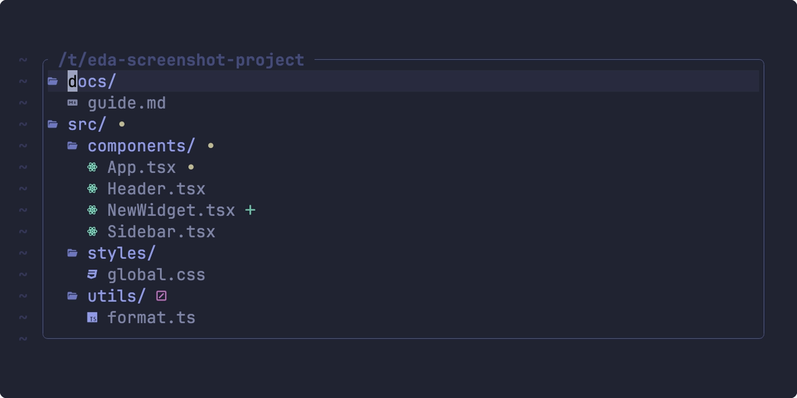
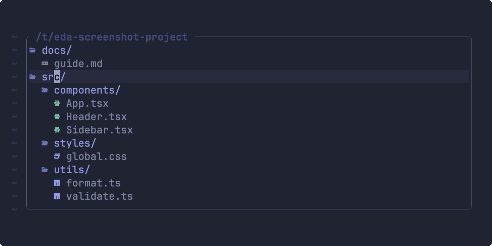
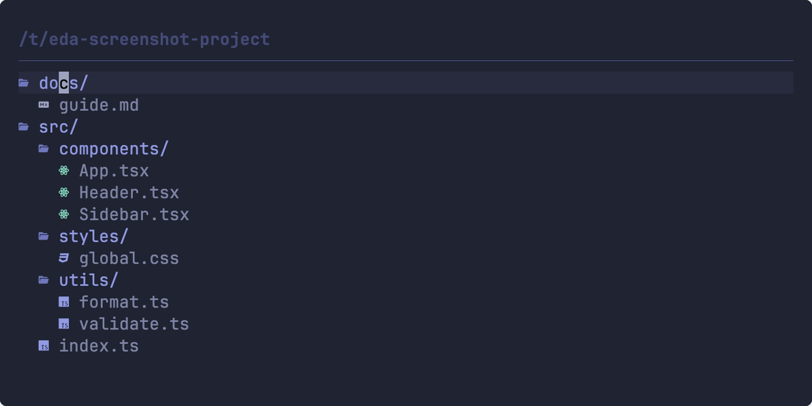
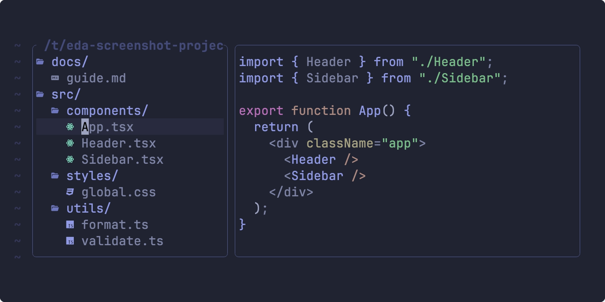
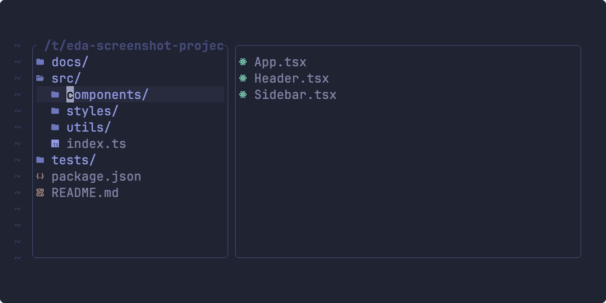
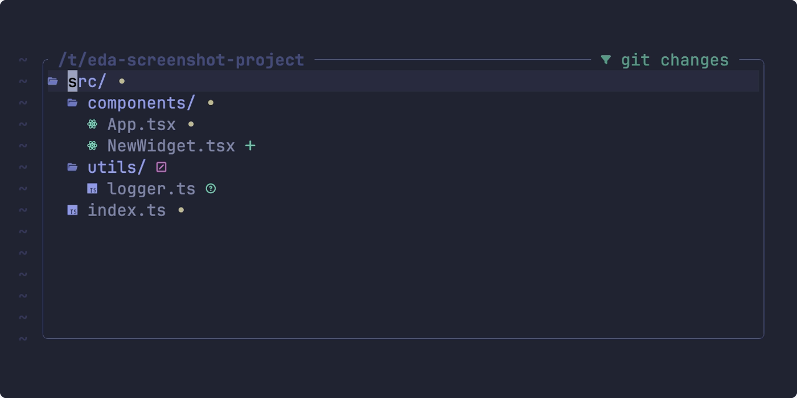
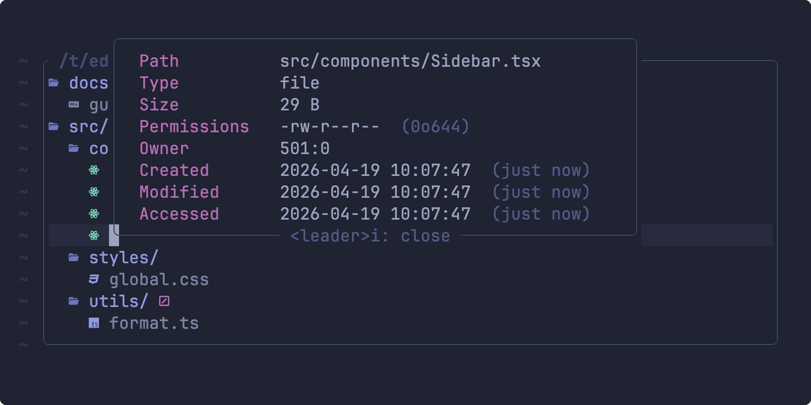
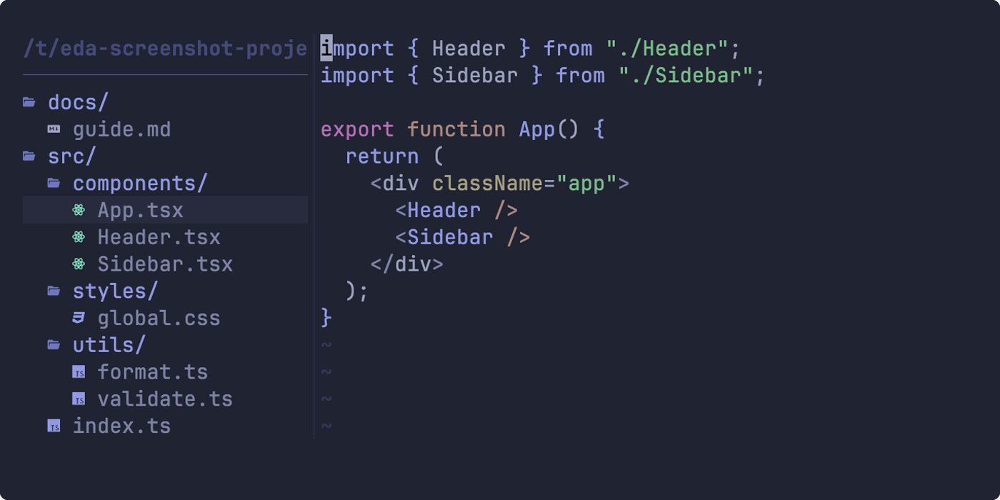

# 🌿 eda.nvim

Explore as a tree, edit as a buffer — a file explorer for Neovim that combines hierarchical navigation with buffer-native file operations.

[](https://github.com/wadackel/eda.nvim/actions/workflows/ci.yaml)

[](LICENSE)

## Demo

### Tree View



### Buffer Editing



### Split Operation



### Preview

| File Preview | Directory Preview |
|--------------|-------------------|
|  |  |

### Filter & Inspect

| Git Changes Filter | Inspect Float |
|--------------------|---------------|
|  |  |

### Layouts

| Split | Replace |
|-------|---------|
|  |  |

## Why eda.nvim?

- ✏️ **Buffer-native editing meets tree view** — Edit the buffer to rename, delete, create, and move files, then `:w` to apply
- ⚡ **Async filesystem scanning** — The requested target's ancestor chain is scanned before the initial render. Directory enumeration and symlink metadata use asynchronous I/O
- 🧩 **Extensible action system** — Every operation lives in a named registry. Custom actions receive the same `ActionContext` as built-in ones, making them first-class citizens
- 🎨 **Rich customization** — Highlight groups, function-based config options (`header.format`, `ignore_patterns`, `preview.max_file_size`), and event hooks for plugin integration

> For architecture and design decisions, see [ARCHITECTURE.md](docs/ARCHITECTURE.md).

## Features

- **Buffer-native editing** — Rename, delete, and create files by editing the buffer, then `:w` to apply
- **Tree view with hierarchy** — Expand and collapse directories within one buffer
- **Async filesystem scanning** — Directory enumeration and symlink resolution run asynchronously; tree preparation and painting run on the main loop
- **Git integration** — Async status detection with visual indicators
- **Image preview** — PNG/JPEG/GIF/WebP/BMP rendered in the preview pane via the Kitty graphics protocol (kitty, Ghostty, WezTerm, including inside tmux)
- **Multiple layouts** — `float`, `split_left`, `split_right`, `replace`
- **Extensible action system** — Named registry with custom actions as first-class citizens
- **netrw replacement** — `hijack_netrw` option for seamless default browsing
- **Highlight groups** — Customize the tree, filesystem state, operations, dialogs, and previews
- **Event hooks** — `EdaTreeOpen`, `EdaTreeClose`, `EdaMutationPre`, `EdaMutationPost`, `EdaRootChanged` for plugin integration. See [`doc/eda.nvim.txt`](doc/eda.nvim.txt) for event payload details.

## Requirements

- Neovim >= 0.11
- [git](https://git-scm.com/) (optional, for git status integration)
- [mini.icons](https://github.com/echasnovski/mini.icons) or [nvim-web-devicons](https://github.com/nvim-tree/nvim-web-devicons) (optional, for file icons)
- A terminal that implements the [Kitty graphics protocol](https://sw.kovidgoyal.net/kitty/graphics-protocol/) (optional, for image preview; verified with kitty, Ghostty, and WezTerm, detected through the protocol's own capability query so other implementations work too)
- [ImageMagick](https://imagemagick.org/) `magick` (optional, for previewing image formats other than PNG and for downscaling large PNGs)

Deletion uses system trash by default: Finder through `osascript` on macOS,
or [trash-cli](https://github.com/andreafrancia/trash-cli)'s `trash-put` on other
platforms. If the backend is missing or fails, eda reports an error and never
falls back to permanent deletion. Run `:checkhealth eda` to check availability,
or explicitly set `delete_to_trash = false` to permanently delete files.

## Installation

<details>
<summary>lazy.nvim</summary>

```lua
{
  "wadackel/eda.nvim",
  opts = {},
}
```

</details>

<details>
<summary>mini.deps</summary>

```lua
local add = MiniDeps.add
add("wadackel/eda.nvim")
require("eda").setup()
```

</details>

<details>
<summary>packer.nvim</summary>

```lua
use({
  "wadackel/eda.nvim",
  config = function()
    require("eda").setup()
  end,
})
```

</details>

## Quick Start

```lua
require("eda").setup()
```

If you do not use an icon plugin, pass `icon = { provider = "none" }` to `setup`.

Open the explorer with the `:Eda` command:

```vim
:Eda                    " Open in current directory (float)
:Eda kind=split_left    " Open as left sidebar
:Eda ~/projects         " Open specific directory
```

> [!TIP]
> Set `hijack_netrw = true` to use eda as the default directory browser. See the [Replace netrw](#recipes) recipe for details.

See [Configuration](#configuration) for a customization example, or the
[full reference](doc/eda.md) for all options.

## Configuration

Pass only the options you want to change; they are merged with the defaults.
For example, use a sidebar with file preview and a mapping to toggle the preview:

```lua
require("eda").setup({
  window = { kind = "split_left" },
  preview = { enabled = true },
  mappings = {
    ["<C-p>"] = "toggle_preview",
  },
})
```

See the [configuration reference](doc/eda.md#configuration) for every option and
its defaults, and [mapping configuration](doc/eda.md#mappings) for custom keys.

## Actions

Built-in and custom actions can be bound through `mappings` or dispatched
programmatically. Press `ga` to choose from registered actions, or `g?` to view
keybinding help.

The [action reference](doc/eda.md#actions) covers every built-in action, including
[file-operation target selection](doc/eda.md#file-operations). See
[default keybindings](doc/eda.md#mappings-1) for the complete mapping table.

### Defining Custom Actions

Register a function under a name, then map it like any built-in. Custom actions also appear in the `actions` picker, so they remain discoverable without a dedicated keymap.

```lua
local action = require("eda.action")

action.register("my_action", function(ctx)
  local node = ctx.buffer:get_cursor_node(ctx.window.winid)
  if node then
    vim.notify("Selected: " .. node.path)
  end
end, { desc = "Show selected file path" })

require("eda").setup({
  mappings = {
    ["<C-x>"] = "my_action",
  },
})
```

See the [Action API](doc/eda.md#action-api) for registration and dispatch
parameters, and [ActionContext](doc/eda.md#actioncontext) for the handles passed
to each action.

#### Example: open a terminal in the directory under the cursor

```lua
local action = require("eda.action")

action.register("open_terminal", function(ctx)
  local node = ctx.buffer:get_cursor_node(ctx.window.winid)
  local dir = node and node.type == "directory" and node.path
    or node and vim.fn.fnamemodify(node.path, ":h")
    or ctx.explorer.root_path
  vim.cmd("split | terminal")
  vim.fn.chansend(vim.b.terminal_job_id, "cd " .. vim.fn.shellescape(dir) .. "\n")
end, { desc = "Open terminal in directory" })

require("eda").setup({
  mappings = {
    ["<C-\\>"] = "open_terminal",
  },
})
```

## Recipes

Common customization patterns. See `:help eda.nvim` for the full configuration reference.

<details>
<summary>Replace netrw</summary>

Use eda.nvim as the default directory browser. `:edit <directory>`, `:Explore`, and other netrw entry points will open eda instead.

```lua
require("eda").setup({
  hijack_netrw = true,
})
```

</details>

<details>
<summary>LSP file operations</summary>

Use the [native LSP rename-notification recipe](doc/eda.md#lsp-rename-notifications)
to notify supporting servers about successfully completed moves, including
partially failed batches. It documents capability setup, workspace and file
filters, and a live-server smoke check. This post-operation handler does not
request pre-rename workspace edits or guarantee updated imports.

</details>

<details>
<summary>Window picker integration</summary>

Use [nvim-window-picker](https://github.com/s1n7ax/nvim-window-picker) (or any picker that returns a window ID) to choose where files open.

```lua
require("eda").setup({
  select_window = function()
    return require("window-picker").pick_window()
  end,
})
```

</details>

<details>
<summary>Custom header with git branch</summary>

Show the current git branch in the header instead of the directory path.

```lua
require("eda").setup({
  header = {
    format = function(root_path)
      local result = vim.system(
        { "git", "-C", root_path, "branch", "--show-current" },
        { text = true }
      ):wait()
      if result.code == 0 and result.stdout ~= "" then
        return result.stdout:gsub("\n", "")
      end
      return vim.fn.fnamemodify(root_path, ":~")
    end,
    position = "left",
  },
})
```

</details>

<details>
<summary>Project-aware ignore patterns</summary>

Dynamically filter files based on project type. Patterns use **Lua pattern syntax** (not glob).

```lua
require("eda").setup({
  ignore_patterns = function(root_path)
    local patterns = { "%.DS_Store$" }
    if vim.uv.fs_stat(root_path .. "/package.json") then
      table.insert(patterns, "^node_modules$")
    end
    if vim.uv.fs_stat(root_path .. "/Cargo.toml") then
      table.insert(patterns, "^target$")
    end
    return patterns
  end,
})
```

</details>

<details>
<summary>Customize highlights</summary>

Override highlight groups to match your colorscheme. The `on_highlight` callback receives the groups table before it is applied — modify entries in-place.

```lua
require("eda").setup({
  on_highlight = function(groups)
    groups.EdaDirectoryName = { fg = "#89b4fa", bold = true }
    groups.EdaDirectoryIcon = { fg = "#89b4fa" }
    -- Apply git status colors to file names (transparent by default)
    groups.EdaGitModifiedName = { link = "EdaGitModified" }
    groups.EdaGitAddedName = { link = "EdaGitAdded" }
  end,
})
```

</details>

<details>
<summary>Customize icons</summary>

Combine `icon.provider`, `icon.directory`, and the `icon.custom` hook to fully control every icon. This example builds a minimal UI with plain Unicode characters — no Nerd Font required.

```lua
require("eda").setup({
  icon = {
    provider = "none",
    directory = {
      collapsed = "▸",
      expanded = "▾",
      empty = "▸",
      empty_open = "▾",
    },
    custom = function(name, node)
      if node.type == "directory" then
        return nil
      end
      return "·", "EdaFileIcon"
    end,
  },
})
```

</details>

## Documentation

The maintained reference is [doc/eda.md](doc/eda.md), also available in Neovim as
`:help eda.nvim`.

- [Configuration](doc/eda.md#configuration) and [default keybindings](doc/eda.md#mappings-1)
- [Actions](doc/eda.md#actions) and [API](doc/eda.md#api)
- [Events](doc/eda.md#events) and [highlight groups](doc/eda.md#highlight-groups)
- [CHANGELOG.md](CHANGELOG.md) — Release history
- [ARCHITECTURE.md](docs/ARCHITECTURE.md) — Architecture, design philosophy, and trade-offs
- [CONTRIBUTING.md](CONTRIBUTING.md) — Development setup and guidelines

## Contributing

Contributions are welcome! See [CONTRIBUTING.md](CONTRIBUTING.md) for development setup and guidelines.

## License

[MIT © wadackel](LICENSE)
